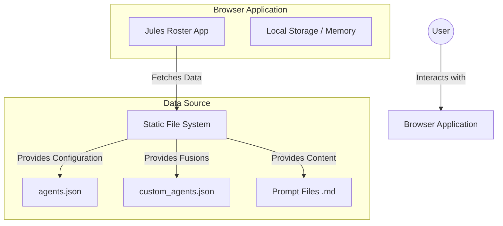
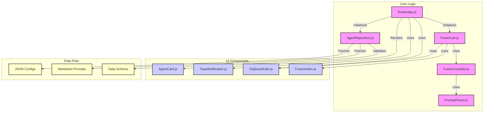
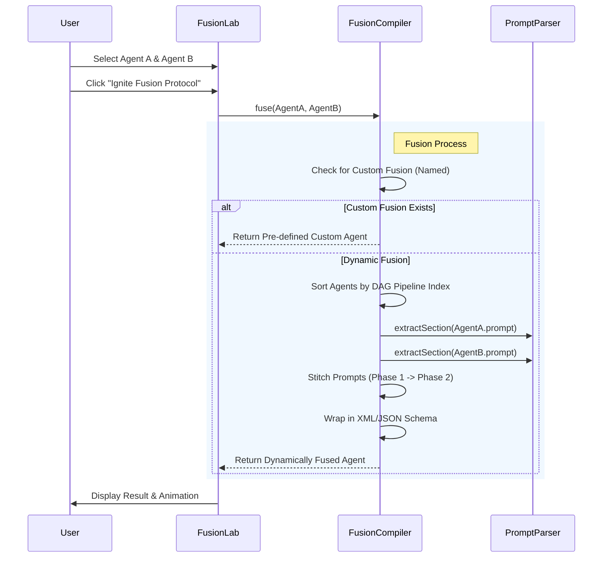

# Jules Master Agent Roster - Architecture

## 1. System Context

High-level view of the application and its interactions with the user and external data sources.

## 2. Component Architecture

Detailed view of the JavaScript modules and their relationships.

## 3. Fusion Logic Flow

The core logic for synthesizing two agents into a single fusion protocol.

## 4. Trust Boundaries

- **Browser**: The entire application runs client-side in the user's browser. No data is sent to a backend server.
- **File System**: The application treats the static file system as a trusted source of configuration and content.
- **External APIs**: The application fetches images from the Emoji Kitchen API (Google) for fusion icons. No user data is sent.

## 5. Key Design Decisions

- **Client-Side Only**: To ensure privacy and ease of deployment (GitHub Pages compatible).
- **Static JSON Configuration**: `agents.json` and `custom_agents.json` drive the UI, allowing for easy updates without code changes.
- **DAG Pipeline**: Agents are executed in a strict Directed Acyclic Graph order (e.g., Architect -> Builder) regardless of selection order, ensuring logical consistency.
- **XML Prompt Structure**: Moving towards structured XML prompts for better parsing and reliability.
