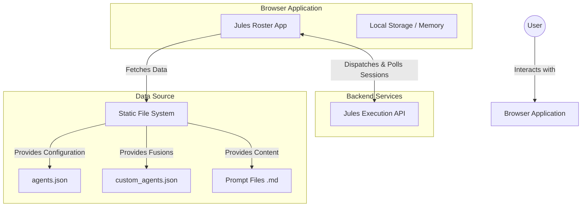
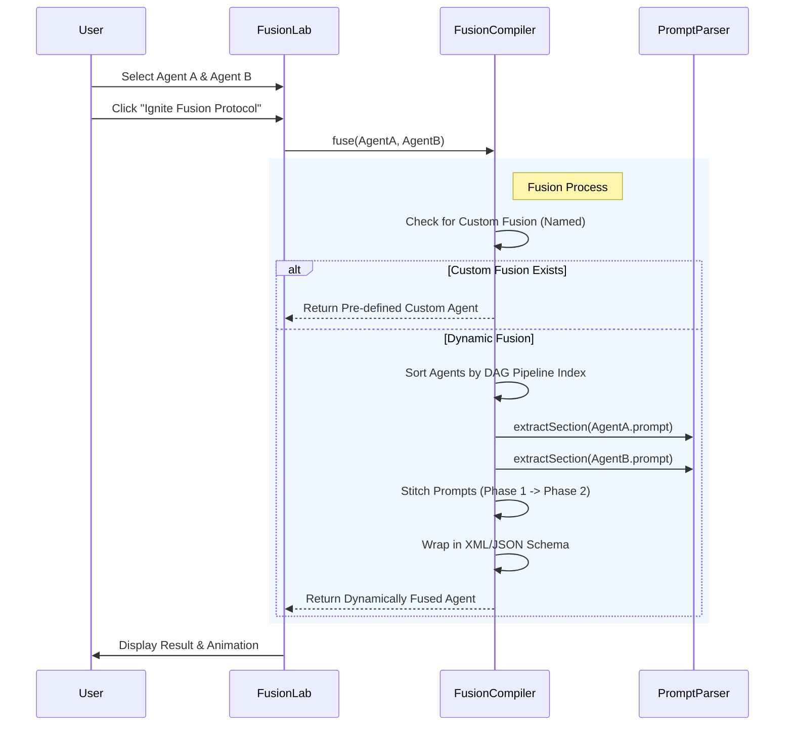

# 🗺️ Jules Master Agent Roster - Architecture

> "A roadmap is a promise, but the architecture is the vehicle." - Architect 🏗️

Welcome to the structural blueprints! This document maps out the high-level system components, data flows, and trust boundaries of the Roster application. We keep things strictly Vanilla JS—no bundlers, no VDOMs, just pure speed. ⚡

## 1. 🌐 System Context

High-level view of the application and its interactions with the user, external data sources, and backend intelligence.

```mermaid
graph TD;
    User((User)) -->|Interacts with| Browser[Browser Application];

    subgraph Browser Application
        App[Jules Roster App];
        Store[Local Storage / Memory];
    end

    subgraph Data Source
        FileSystem[Static File System];
        AgentsJSON[agents.json];
        CustomAgentsJSON[custom_agents.json];
        Prompts[Prompt Files .md];
    end

    subgraph Backend Services
        JulesAPI[Jules Execution API];
    end

    App -->|Fetches Data| FileSystem;
    FileSystem -->|Provides Configuration| AgentsJSON;
    FileSystem -->|Provides Fusions| CustomAgentsJSON;
    FileSystem -->|Provides Content| Prompts;
    App <-->|Dispatches & Polls Sessions| JulesAPI;
```

## 2. 🧩 Component Architecture

Detailed view of the JavaScript modules and their relationships mapped to the actual directory structure.

```mermaid
graph TD;
    subgraph Core Logic
        RosterApp[js/core/RosterApp.js]
    end

    subgraph Features
        subgraph Fusion
            FusionLab[js/Features/Fusion/FusionLab.js]
            FusionCompiler[js/Features/Fusion/FusionCompiler.js]
            FusionIndex[js/Features/Fusion/FusionIndex.js]
            FusionAnimation[js/Features/Fusion/FusionAnimation.js]
            AgentPicker[js/Features/Fusion/AgentPicker.js]
            RarityEngine[js/Features/Fusion/RarityEngine.js]
        end
        subgraph Pinned
            PinnedManager[js/Features/Pinned/PinnedManager.js]
        end
        subgraph Jules Integration
            JulesManager[js/Features/Jules/JulesManager/JulesManager.js]
        end
    end

    subgraph Services
        AgentRepo[js/Services/AgentRepository.js]
        JulesService[js/Services/JulesAPI.js]
    end

    subgraph UI Components
        AgentCard[js/UI/AgentCard/AgentCard.js]
        Toast[js/UI/Toast/ToastNotification.js]
        Clipboard[js/UI/Clipboard/ClipboardUtils.js]
        SearchCtrl[js/Features/Search/SearchController.js]
        ExportCtrl[js/Features/Export/ExportController.js]
    end

    subgraph Utilities
        FormatUtils[js/Utils/format-utils.js]
        DownloadUtils[js/Utils/download-utils.js]
        PerformanceUtils[js/Utils/performance-utils.js]
        MarkdownRenderer[js/Utils/markdown-renderer.js]
        StorageUtils[js/Utils/storage-utils.js]
        PromptParser[js/Utils/prompt-parser.js]
        DomUtils[js/Utils/dom-utils.js]
    end

    subgraph Data Flow
        JSON[JSON Configs]
        MD[Markdown Prompts]
        Schema[Data Schema]
    end

    %% Relationships
    RosterApp -->|Initializes| AgentRepo;
    RosterApp -->|Initializes| FusionLab;
    RosterApp -->|Initializes| PinnedManager;
    RosterApp -->|Initializes| JulesManager;
    RosterApp -->|Initializes| SearchCtrl;
    RosterApp -->|Initializes| ExportCtrl;
    RosterApp -->|Renders| AgentCard;
    RosterApp -->|Uses| Toast;
    RosterApp -->|Uses| PerformanceUtils;

    FusionLab -->|Uses| FusionCompiler;
    FusionLab -->|Uses| FusionIndex;
    FusionLab -->|Uses| FusionAnimation;
    FusionLab -->|Uses| AgentPicker;
    FusionLab -->|Uses| RarityEngine;

    FusionCompiler -->|Uses| PromptParser;
    FusionCompiler -->|Uses| MarkdownRenderer;

    AgentRepo -->|Fetches| JSON;
    AgentRepo -->|Fetches| MD;
    AgentRepo -->|Validates| Schema;

    JulesManager -->|Delegates to| JulesService;

    AgentCard -->|Uses| FormatUtils;
    AgentCard -->|Uses| MarkdownRenderer;
    AgentCard -->|Uses| DomUtils;

    PinnedManager -->|Uses| StorageUtils;
    FusionIndex -->|Uses| StorageUtils;

    ExportCtrl -->|Uses| DownloadUtils;

    classDef core fill:#f9f,stroke:#333,stroke-width:2px;
    classDef features fill:#d4edda,stroke:#333,stroke-width:2px;
    classDef ui fill:#ccf,stroke:#333,stroke-width:2px;
    classDef data fill:#ffc,stroke:#333,stroke-width:2px;
    classDef utils fill:#fff3cd,stroke:#333,stroke-width:2px;
    classDef services fill:#cce5ff,stroke:#333,stroke-width:2px;

    class RosterApp core;
    class FusionLab,FusionCompiler,FusionIndex,FusionAnimation,AgentPicker,RarityEngine,PinnedManager,JulesManager features;
    class AgentCard,Toast,Clipboard,SearchCtrl,ExportCtrl ui;
    class FormatUtils,DownloadUtils,PerformanceUtils,MarkdownRenderer,StorageUtils,PromptParser,DomUtils utils;
    class AgentRepo,JulesService services;
    class JSON,MD,Schema data;
```

## 3. 🧪 Fusion Logic Flow

The core logic for synthesizing two agents into a single fusion protocol. It relies on a pure DAG pipeline to enforce logic stability!

```mermaid
sequenceDiagram
    participant User
    participant FusionLab
    participant FusionCompiler
    participant PromptParser

    User->>FusionLab: Select Agent A & Agent B
    User->>FusionLab: Click "Ignite Fusion Protocol"
    FusionLab->>FusionCompiler: fuse(AgentA, AgentB)

    rect rgb(240, 248, 255)
        note right of FusionCompiler: Fusion Process
        FusionCompiler->>FusionCompiler: Check for Custom Fusion (Named)
        alt Custom Fusion Exists
            FusionCompiler-->>FusionLab: Return Pre-defined Custom Agent
        else Dynamic Fusion
            FusionCompiler->>FusionCompiler: Sort Agents by DAG Pipeline Index
            FusionCompiler->>PromptParser: extractSection(AgentA.prompt)
            FusionCompiler->>PromptParser: extractSection(AgentB.prompt)
            FusionCompiler->>FusionCompiler: Stitch Prompts (Phase 1 -> Phase 2)
            FusionCompiler->>FusionCompiler: Wrap in XML/JSON Schema
            FusionCompiler-->>FusionLab: Return Dynamically Fused Agent
        end
    end

    FusionLab->>User: Display Result & Animation
```

## 4. 🛡️ Trust Boundaries

- **Browser**: The primary application runs client-side in the user's browser, handling all layout and prompt parsing.
- **File System**: The application strictly treats the static file system as a trusted source of configuration (JSONs) and content (Markdown).
- **Backend APIs (`JulesService`)**: The Jules Manager connects securely to external backend services for launching agent sessions, strictly enforcing local API key management.
- **External Assets**: The application fetches generated fusion icons from the Google Emoji Kitchen API. No sensitive user data is ever sent during icon resolution.

## 5. 🎯 Key Design Decisions

- **Client-Side Foundation**: Built purely to ensure portability, performance, and immediate GitHub Pages compatibility without any Node.js build steps.
- **Colocated Features**: We use `js/Features` to group domains (like `Fusion` or `JulesManager`) independently to avoid a monolithic structure!
- **Asynchronous Execution API**: Rather than waiting on blocking HTTP connections, `JulesManager.js` utilizes continuous polling intervals against `getActivities` to simulate real-time terminal progress.
- **Strict DAG Pipeline**: Agents are processed and combined via a strict Directed Acyclic Graph order (e.g., `Architect` -> `Wordsmith`), ensuring logical consistency no matter what order the user clicked.

## 6. 🧼 Data Integrity & Parsing

To ensure reliable data flow from the static file system to the UI, the system enforces a strict parsing and validation strategy. The application relies on `safeJsonParse` wrappers that capture raw response errors and decorate them with human-readable context. Rather than failing silently, invalid payloads trigger explicit warnings, ensuring broken configurations (`agents.json` or `custom_agents.json`) are easily diagnosed without requiring deep network inspection.

## 7. 🔒 Security Model

The project employs a defense-in-depth approach to XSS and malicious injections:

1. **Input Validation (`AgentRepository.js`)**: All dynamically loaded or custom agent data is scrubbed against a robust malicious pattern regex targeting dangerous tags (`<script>`, `<iframe>`, `<object>`, etc.), event handlers (`on*`), and active URI schemes (`javascript:`, `vbscript:`). Any entry matching these patterns is immediately invalidated.
2. **Centralized Escaping (`format-utils.js`)**: Before any user-controlled data is injected into DOM sinks, it is aggressively encoded using a global `FormatUtils.escapeHTML()` utility, preventing execution of any structural artifacts that slip past initial validation.
